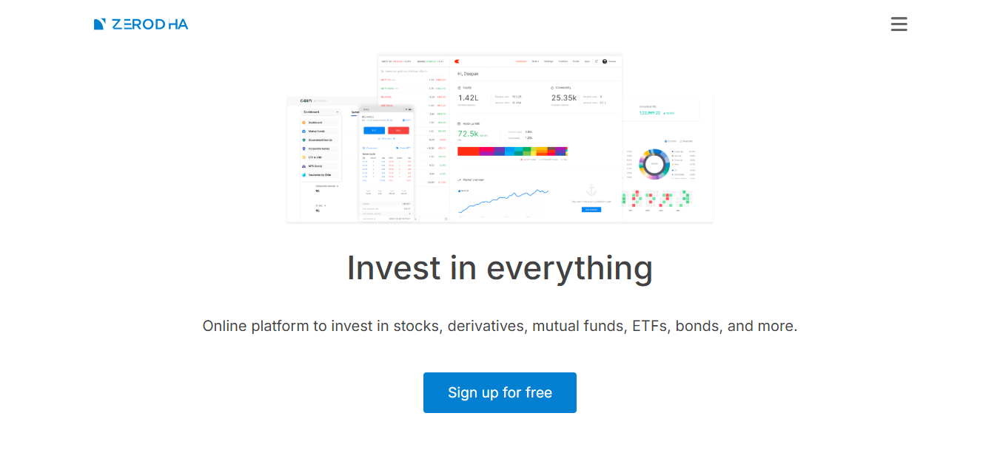

# Zerodha Landing Page Clone


> A responsive, pixel-perfect landing page clone inspired by [Zerodha](https://zerodha.com) built using HTML and CSS.

---

## 📸 Preview



---

## 🚀 Features

- ✅ Fully responsive hero section using `calc(100vh - 100px)`
- ✅ Clean and semantic HTML5 structure
- ✅ CSS Grid and Flexbox layout for modern responsiveness
- ✅ Fixed navigation bar with hover effects
- ✅ Sections:
  - Hero
  - Trust with confidence
  - Unbeatable pricing
  - Market education
  - Footer with legal disclaimers & links
- ✅ Mobile-friendly layout with media queries

---

## 🛠️ Tech Stack

- **HTML5**
- **CSS3**
- **Font Awesome (via CDN)**
- **Google Fonts – Inter**

---

## 📁 Project Structure

```
zerodha-landing-page/
│
├── index.html
├── styles.css
├── images/
│   ├── logo.svg
│   ├── landing-page.png
│   ├── pricing-eq.svg
│   ├── other-trades.svg
│   ├── ecosystem.png
│   ├── press-logos.png
│   └── index-education.svg
```

---

## 🧑‍💻 Getting Started

### 1. Clone the repository

```bash
git clone https://github.com/your-username/zerodha-landing-page.git
cd zerodha-landing-page
```

### 2. Open `index.html` in your browser

You can simply open the file using:

```bash
start index.html   # For Windows
open index.html    # For macOS
```

Or use the Live Server extension in VS Code for live preview.

---

## 📱 Responsive Design

The layout adapts beautifully to all screen sizes using CSS Grid and Flexbox.  
Special styles for devices under `768px` width are included.

---

## 🧪 Browser Compatibility

- ✅ Chrome  
- ✅ Firefox  
- ✅ Safari  
- ✅ Edge  

---

## 📝 License

This project is licensed under the MIT License — see the [LICENSE](./LICENSE) file for details.

---

## 🙋‍♂️ Author

**Shashwat Rao**  
[GitHub Profile](https://github.com/shashwattt26)  
Email: shashwatrao26@gmail.com

---

## 🌟 Acknowledgments

- [Zerodha](https://zerodha.com) for design inspiration  
- [Font Awesome](https://fontawesome.com)  
- [Google Fonts](https://fonts.google.com)

---

## 📌 Future Improvements

- Add JavaScript-based mobile navigation toggle  
- Improve accessibility (ARIA labels, contrast)  
- Convert to React or Tailwind CSS for dynamic version  
